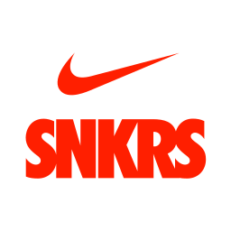

<!-- PROJECT LOGO -->
<br />
<p align="center">
    <a href="https://github.com/rohitjethoe/snkrs-bot">
        
    </a>
    <h3 align="center">snkrs-bot</h3>
    <p align="center">
        SNKRS Netherlands Automated Bot
        <br />
        <a href="https://github.com/rohitjethoe/snkrs-bot"><strong>Explore the docs »</strong></a>
        <br />
        <br />
        <a href="https://github.com/rohitjethoe/snkrs-bot">View Site</a>
        ·
        <a href="https://github.com/rohitjethoe/snkrs-bot/issues">Report Bug</a>
        ·
        <a href="https://github.com/rohitjethoe/snkrs-bot/issues">Request Feature</a>
    </p>
</p>

<!-- TABLE OF CONTENTS -->
## Table of Contents
* [About the Project](#about-the-project)
    * [Built With](#built-with)
* [Features](#features)

<!-- ABOUT THE PROJECT -->
## About The Project
(Still in development...)
A fully automated sneaker bot for purchasing exclusive sneakers on the Nike Netherlands SNKRS site.

Feel free fork and edit this project to your liking.

### Built With

* [Node.js](https://nodejs.org/en/)
* [Electron](https://www.electronjs.org/)
* [Vue 3](https://vuejs.org/)
* [Puppeteer](https://github.com/puppeteer/puppeteer)
* [Node Cron](https://github.com/node-cron/node-cron)

### Features
Beta v0.9.1
- Nike SNKRS (NL) Stock checker.

### Installation

1. Clone the repo
```sh
git clone https://github.com/rohitjethoe/snkrs-bot.git
```
2. Install NPM packages
```sh
npm install
```
or
```sh
npm install
```
2. Load MacOS/Windows Application
```sh
npm run electron:serve
```